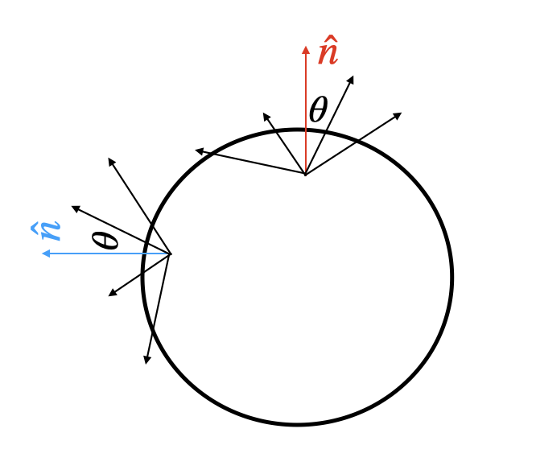

# Polarized Radiative Transfer --- Code (1950)

This module implements the radiative-transfer problem described by Code (1950), which assumes the following:
1. plane-parallel atmosphere: all quantities varies only in the direction of the normal $\hat{n}$ of the choosen surface (which will be the z axis)
2. semi-infinite atmosphere: it extends from $\tau=\infty$ (deepest layer) to $\tau=0$ (surface)
3. gray atmosphere 
4. constant net flux of radiation: $dF_z/dz=0$
5. Thomson (multiple) scattering and absorption. 

Code describes the radiation field with two orthogonal linear-polarization intensities $I_l(\tau,\mu), I_r(\tau,\mu)$ in a frame locally axially symmetric (so $U_{\rm local}=0)$.
  Its main goal is to compute the emergent  polarized intensities $I_l(0,\mu), I_r(0,\mu)$ for an arbitrary outgoing direction $\mu=\cos\theta$ (with $\theta$ being the angle from the z axis) at the surface $\tau=0$, and then
\[
I_{\rm local}=I_l+I_r,\qquad Q_{\rm {local}}=I_r-I_l,\qquad 
P_{\rm local}=\frac{Q_{\rm local}}{I_{\rm local}}. 
\]
The implementation follows the structure of Code's derivation but uses a matrix/eigenvalue formulation for the discrete transfer problem. 


## 1. Main class

Create an atmosphere with

``` python
atm = Code1950Atmosphere(lam=lambda, n=3, F=F)
```

Here

\[ \lambda=\frac{\kappa}{\kappa+\sigma}, \]

where $\kappa$ is true-absorption opacity and ($\sigma$) is Thomson-scattering opacity. Thus $\lambda=0$ is pure scattering and $\lambda=1$ is pure absorption.

`n` controls the angular quadrature (Code uses 2n Gauss-Legendre directions).
`F` is the total radiative flux $ F=F_l+F_r$.

## 2. Calculation flow
We first solve the atmosphere at the Gauss-Legendre directions. We used this to know the source function and propagate it to evaluate the emergent radiation at an arbitrary physical observer direction.
The numerical implementation is as follows:
``` text
lambda, n, F
      |
      v
Gauss-Legendre quadrature to solve rad.transfer 
      |  __init__()
      v
find the Legendre zeros mu_i and the Gaussian weigthts a_i 
      |  _build_transfer_matrix()
      v
build matrix A to solve eqs. (19)-(20) in Code50
      | _solve_surface_modes()
      v
1. fibd eigenmodes of A for general tau, discarding the diverging ones (1st boundary cond)
2. (add linear constant-flux solution and) compute I at the surface (tau=0, with bound cond. from eqs. (44)-(46)) to find Q and mode amplitudes
      |  _y_at_tau(), eqs. 42–43 
      v
I_l,i, I_r,i for a chosen tau for the Gauss-Legendre directions
      |
      v
J_l, J_r, K_l with quadrature, eqs. 55-57
      |  _source_function(), eqs. 65–66
      v
S_l(tau,mu), S_r(tau,mu)
      |  emergent(mu)
      v
formal solution, eq. (69)
      |
      v
I_l(0,mu), I_r(0,mu)
      |
      v
I, Q_local, P_local
```


## 3. Angular quadrature --- `__init__()`

Code replaces angular integrals by Gauss-Legendre quadrature,

\[
\int_{-1}^{1}f(\mu),d\mu\simeq\sum_i
a_i f(\mu_i). \]

The 2n values $\mu_i$ are roots of $P_{2n}$, with corresponding weights $a_i$.
The implementation constructs them with

``` python
self.mu_quad, self.a_quad = leggauss(2*self.n)
```


## 4. Discrete transfer equations --- `_build_transfer_matrix()`

After quadrature, Code's equations (19)-(20) become a finite coupled system for $ I_{l,i}(\tau), I_{r,i}(\tau)$. The implementation collects them into
\[ \mathbf y= (I_{l,1},\ldots,I_{l,2n},
I_{r,1},\ldots,I_{r,2n})^T, \]
coupled by a transfer matrix A constructed by

``` python
_build_transfer_matrix()
```


## 5. `_solve_surface_modes()`

#### Eigenmodes

Code seeks homogeneous solutions (eq.21) proportional to

\[ I_{l,i}\propto g_i e^{-k\tau},\qquad
I_{r,i}\propto h_i e^{-k\tau}. \]

In the matrix formulation this becomes an eigenvalue problem,

\[ A\mathbf v_m=k_m\mathbf v_m, \]

computed with

``` python
vals, vecs = eig(self.A)
```

Each matrix mode behaves as $\mathbf v_m e^{k_m\tau}$. 

NB: The sign convention differs from Code's: Code writes decaying modes as $e^{-k\tau}$ with positive k, whereas my matrix  uses $e^{k_m\tau}$.

#### Semi-infinite atmosphere condition

A physical semi-infinite atmosphere cannot contain solutions that diverge as $\tau\to\infty$. Remembering that $k_m=a+ib$ and so $ \|e^{k_m\tau}\|=e^{\operatorname{Re}(k_m)\tau}$, we just keep the modes with $\operatorname{Re}(k_m)<0$, which decay with depth. The implementation retains them using a condition such as

``` python
keep = np.where(np.real(vals) < -tol)[0]
```

This corresponds to the step leading to Code's equations (42)-(43), where growing exponential terms are removed.


#### Linear constant-flux solution

The exponential modes are not the whole solution. Code also obtains (eq. (39))

\[ I_{l,i}=I_{r,i}=b(\tau+\mu_i+Q). \]

The full solution is schematically

\[ \mathbf y(\tau) =
\mathbf y_{\rm linear}(\tau) + \sum_m
c_m\mathbf v_m e^{k_m\tau}, \]

where the linear term is the deep constant-flux solution. The exponential modes are surface corrections and vanish at large optical depth.


#### Surface boundary conditions --- equations (44)-(46)

At the surface ($\tau=0$) there is no external incident radiation. Therefore for incoming directions (i.e. $\mu_i<0$ since $\mu$ is measured locally from the normal to the surface),

\[ I_l(0,\mu_i)=I_r(0,\mu_i)=0. \]

The incoming quadrature indices are

``` python
inc = np.where(self.mu_quad < 0.0)[0]
```

At the surface, for each incoming direction,

\[ 0=b(\mu_i+Q)+\sum_m c_m v_{m,i} \Rightarrow bQ+\sum_m c_m v_{m,i}=-b\mu_i. \]

The unknowns are

\[ \mathbf x=(Q,c_1,c_2,\ldots)^T. \]


They are assembled into

\[ M\mathbf x=\mathbf{rhs} \]

with

``` python
M = np.column_stack((
    b * ones[incoming],
    eigvecs[incoming, :]
))

rhs = -b * mu_dup[incoming]

x = np.linalg.solve(M, rhs)
```
Solving it determines $Q$ and the amplitudes of the retained decaying modes.

## 6. Radiation field versus depth --- `_y_at_tau()`

Once the boundary conditions have fixed all the coefficients, the discrete atmosphere is solved.
``` python
_y_at_tau(tau)
```
evaluates  $I_{l,i}(\tau), I_{r,i}(\tau)$ at all Gauss-Legendre directions (eqs. (42)-(43)).


## 7. Angular moments

The solved intensities are used to calculate the moments $J_l(\tau), J_r(\tau), K_l(\tau)$ from eqs. 55-57. 

NB: $I=I(\tau,\mu)$ is directional. $J=J(\tau)$ is its angular mean (and it's given by $J=J_l+J_r$). $B=B(\tau)$ is the isotropic Planck function of the material. Since we assume LTE, $B=J$.
Near the surface the radiation field is anisotropic and generally $I(\mu)\neq J$.

 
## 8. Source functions --- `_source_function()`

The angular moments are inserted into Code's equations (65)-(66), from us evaluated by

``` python
_source_function(tau, mu)
```

The terms proportional to $1-\lambda$ are the polarized Thomson-scattering source. The terms proportional to $\lambda$ are true absorption. The rest are by unpolarized thermal emission. Because thermal emission is unpolarized, it contributes equally to $I_l$ and $I_r$.

## 9. Emergent intensity --- `emergent(mu)`

The above procedure solves atmosphere at the quadrature directions $\mu_i$, but the physical observer can have any outgoing direction $\mu_{\rm obs} = \hat{\mathbf n}_{\rm local}\cdot\hat{\mathbf n}_{\rm obs}$ (with $0<\mu_{\rm obs}\leq1$)).

From eq. (69), is

\[ I_q(0,\mu) = \int_0^\infty
S_q(\tau,\mu) e^{-\tau/\mu}
\frac{d\tau}{\mu}, \qquad q=l,r. \]

So we reconstruct the source function from the solved discrete atmosphere and numerically evaluate the formal integral to have the intensity in

``` python
emergent(mu)
```

It returns

``` python
Il, Ir, I, Q, P
```

with $I, Q, P$ defined as the beginning of the README.

NB:  `Code1950Atmosphere` solves only the local one-dimensional plane-parallel problem (e.g., referring to the figure at the beginning: it solves only for the patch defined by the red arrow). Thus, for a chosen observer, we have (after rotating into the observer-sky basis) to sum the contribution coming from every visible patch (e.g., referring to the figure at the beginning: consider the contribution of both the patch defined by the red arrow and the one from the blue arrow).

## 10. Polarization orientation

With

\[ Q_{\rm local}=I_r-I_l, \]

positive local $Q$ corresponds to polarization perpendicular to the local meridian plane, which contains $\hat{\mathbf n}_{\rm local}
\,\text{and}\, \hat{\mathbf n}_{\rm obs}$.

A sky-plane direction perpendicular to it is therefore proportional to

\[ \hat{\mathbf e}_{\rm pol} =
\hat{\mathbf n}_{\rm obs}\times
\hat{\mathbf n}_{\rm local}. \]

If its angle in a fixed observer basis is $\phi_k$,

\[ Q_k=Q_{{\rm local},k}\cos2\phi_k,
\qquad
U_k=Q_{{\rm local},k}\sin2\phi_k. \]


This is done in `compute_polarization_code()`, where the steps are:

1.  determines the local normal of each surface patch (we aproximate is as flux direction: $\hat{\mathbf n}_{\rm local} \simeq
\hat{\mathbf F} = \mathbf F/|\mathbf F|$);
2.  selects visible elements ($\eta\equiv\hat{\mathbf n}_{\rm obs}\cdot\hat{\mathbf n}_{\rm local}>0$);
3.  calls `atmosphere.emergent(eta_k)` for the k visible surface;
4.  rotates into the common sky basis;
5.  find the Stokes parameters as

\[ I_{\rm net}=\sum_k w_k I_k, \qquad
Q_{\rm net}=\sum_k w_k Q_k, \qquad
U_{\rm net}=\sum_k w_k U_k. \]

The net linear-polarization fraction is

\[ P_{\rm net} =
\frac{\sqrt{Q_{\rm net}^2+U_{\rm net}^2}}
{I_{\rm net}}. \]

For photospheric surface elements, the weights are given by the projected area,

\[ dA_{\rm proj}=\mu_k\,dA_k. \]

NB for numerical implementation: If `weight` represents $dA_k$, we compute $w_k=\eta_kdA_k$. If `weight` = projected area, we do not multiply by $\eta_k$ again.


## Validation strategy

### Local atmosphere

First test `Code1950Atmosphere` alone against Code's tabulated $I_l(0,\mu),\, I_r(0,\mu)$ and polarization values. 

### Disk
A flat disk should satisfy $ P_{\rm net}=P_{\rm local}$. 

### Sphere
A symmetric sphere should give $P=0$.

